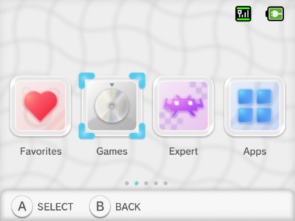

# MiyU — OnionOS Theme for Miyoo Mini / Miyoo Mini Plus

MiyU is a custom OnionOS theme inspired by Nintendo's Wii U visual style, adapted for the Miyoo Mini and Miyoo Mini Plus. This repository contains the theme ZIP file and installation instructions.

## Preview
  

## Installation
1. Download the latest `MiyU by nrdcc.zip` release from https://github.com/nrdcc/miyu/releases/.
2. Copy `MiyU by nrdcc.zip` to the `/Themes/` folder on the SD card root.  
3. Reboot your Miyoo Mini / Miyoo Mini Plus.  
4. Open Apps → Themes and select **MiyU**.

## Attribution
This project is an unofficial, fan-made theme and is not affiliated with or endorsed by Nintendo. All references to the Wii U name, logos, and other Nintendo-owned trademarks belong to Nintendo. 
